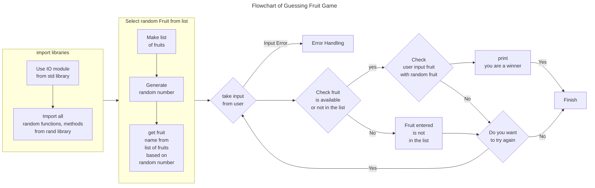
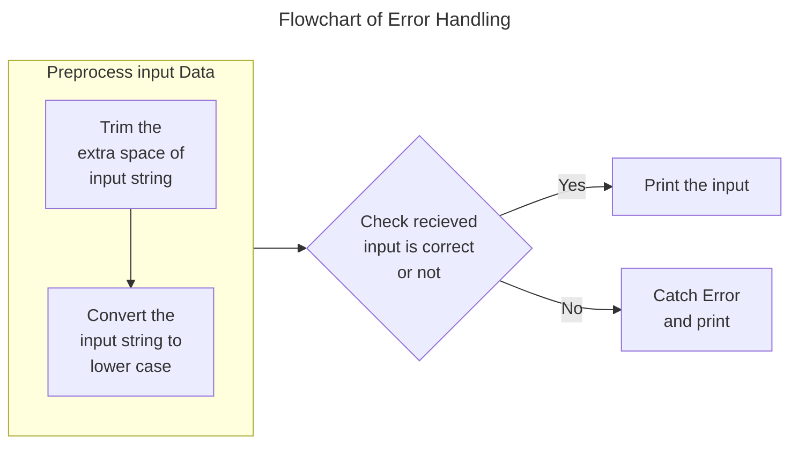

# Guessing Game
*by Kalpa Behera*
---






> To take input from users.

`use std::io;`

*Use **io** modules from **std** library.*

> We want to generate Random number.

`use rand::prelude::*;`

*From **rand** library we will take **prelude** item.
From **prelude** item take all methods.*

> Let's take a list of fruits.

`let guess_list = ["grapes","banana","oranges"];`

> Create a random number.

`let mut rng = thread_rng();`

***thread_rng()** is a method to generate random number.*

> Create a random number in a range.

`let index = rng.gen_rang(0..guess_list.length());`

***gen_rang** will create random number between 0 and length of guess_list.*

*Here 0 is included but length of guess_list excluded.*

> Find random fruit

`let random_fruit = guess_list[index];`

*Random fruit will be selected from guess_list based upon random number saved in index*

> Take input from user, compare with random_fruit.

`let mut input = String::new()`

*Input type String*

> Check input type whether it's correct input or not(Error Handling).

```Rust
match io::stdin().read_line(&mut input){
    ok(_)=>{
        let fruit_selected = input.trim().to_lowercase();
        println!("Fruit Selected",fruit_selected)
    }
    Err(error)=>{
        println("Error is {}",error);
    }
}
```
***ok(_)** Here "_" used to take all input type.*

***input.trim()** is used to trim extra spaces.*

***input.to_lowercase()** is used to convert each letter to lower case.*

```Rust
    Err(error)=>{
        println!("Error is {}",error);
    }
```

***Err** will catch the error & **println!** will print the error*


