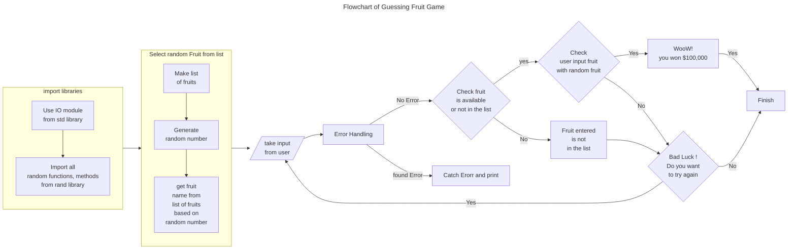
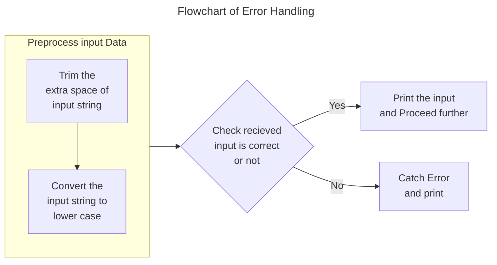

# Guessing Game
*by Kalpa Behera*
---

<mark> Use IO modules from std library.</mark>

`use std::io;`

*To take input from users*

<mark>Import all random functions, methods from rand library.</mark>

`use rand::prelude::*;`

*From **rand** library we will take **prelude** item.*

*From **prelude** item take all methods.*

*We want to generate Random number*

> Make list of fruit.

`let guess_list = ["grapes","banana","oranges"];`

> Generate random number.

`let mut rng = thread_rng();`

***thread_rng()** is a method to generate random number.*

> get fruit name from list of fruits based on random number.

1. Create a random number in a range.

`let index = rng.gen_rang(0..guess_list.length());`

***gen_rang** will create random number between 0 and length of guess_list.*

*Here 0 is included but length of guess_list excluded.*

2. Find random fruit

`let random_fruit = guess_list[index];`

*Random fruit will be selected from guess_list based upon random number generated and saved in index*

> take input from user.

`let mut input = String::new()`

 *Input type String*

> Error Handling.

`match io::stdin().read_line(&mut input){}`
***match** is useed to check user input*
***read_line** is a method of **stdin()**, it returns result types.*
`ok(_)=>{}`

***ok(_)** Here "_" used to return input type(Correct/ not Correct).*

> Catch Error and print.

`Err(error)=>{}`

***Err** will catch the **error***

> Preprocess input Data.
1. Trim the extra space of input string.
2. Convert the input string to lower case.

`let fruit_selected = input.trim().to_lowercase();`

***input.trim()** is used to trim extra spaces.*

***input.to_lowercase()** is used to convert each letter to lower case.*

> Check fruit is available or not in the list.

`if !guess_list.contains(&fruit_selected.as_str)`

***as_str** converts string to **&str**.*

> Compare user input fruit with Random fruit.

`if guess_checker(&fruit_selected, random_fruit){}`

*It will compare the values between fruit_selected and random_fruit.*

`fn guess_checker(fruit_selected:&str, random_fruit:&str)->bool{}`

*It Creates a function guess_checker, which takes input fruit_selected and random_fruit of type **&str**.*

***->bool** will return boolean.*

`return fruit_selected == random_fruit`

*It will return true or false based on comparison*

